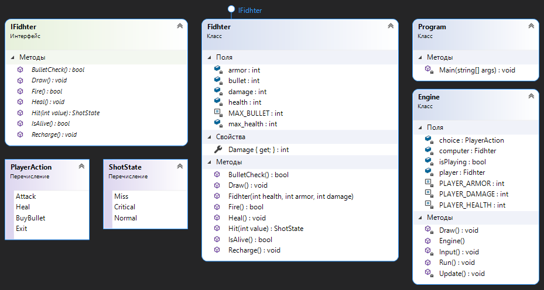

 
# GameFighter
---
**GameFighter** - это консольная игра на одного игрока. 

В данном проекте я в целях закрепления теоретических знаний по C# написал простую игру для одного игрока. Это улучшенная версия предыдущего проекта. 

## License
---
GameFighter - это игра с открытым исходным кодом под [лицензией MIT](https://opensource.org/licenses/MIT).
