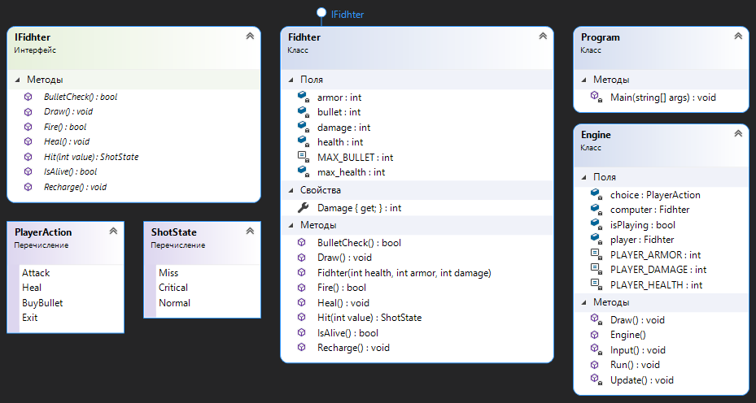

# GameFighter

 
 
 

**GameFighter - это консольная игра на одного игрока.** 

В данном проекте я в целях закрепления теоретических знаний по C# написал простую консольную игру для одного игрока.

# Поддерживаемые версии .NET

Данное программное обеспечение работает на .NET core версии 6.

## Установка

Данную игру можно запустить не устанавливая. Для этого выполняется сборка проекта и запускаеться .exe.

## Авторы

[Okolo IT](https://vk.com/okolo_it_govnokoding)

## Лицензия
>GameFighter - это игра с открытым исходным кодом под [лицензией MIT](https://github.com/SilverWolf2k20/GameFighter/blob/master/LICENSE.md).
